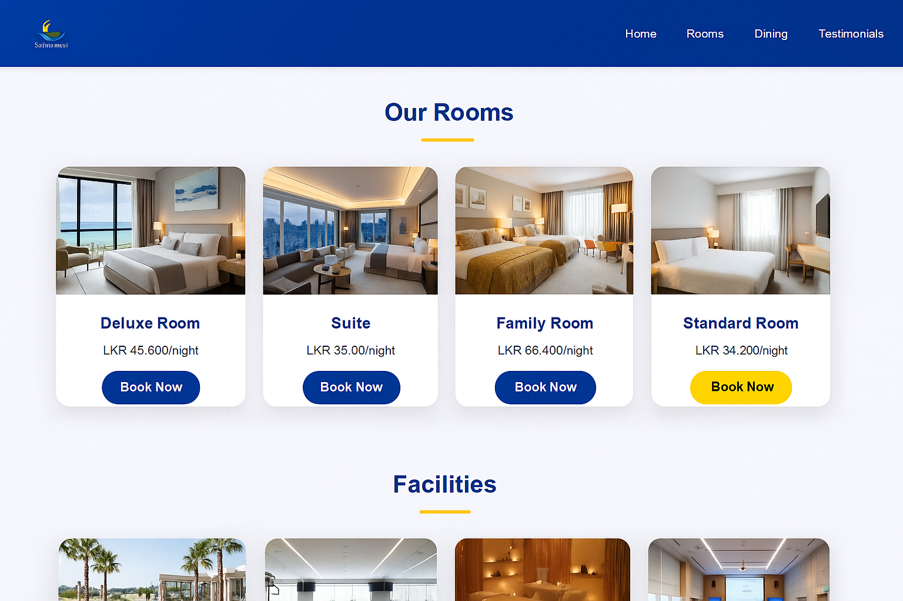

# 🌅 Simple Website for Sunrise Hotel

A modern, responsive website built using **HTML5** and **CSS3** for the fictional **Sunrise Hotel**.  
The site showcases hotel rooms, dining options, facilities, guest testimonials, and contact forms in a clean and elegant design.

---

## 📸 Cover Image



---

## ✨ Features

- 🏨 **Home Page** – Welcoming banner with hotel branding  
- 🛏️ **Rooms Page** – Deluxe, Suite, Family, and Standard room details  
- 🍽️ **Dining Page** – Restaurant, Café, Bar, and Menu highlights  
- 💆 **Facilities Section** – Swimming pool, gym, spa, and conference hall  
- 💬 **Testimonials** – Guest reviews with optional audio/video media  
- 📩 **Contact Page** – Contact form and newsletter subscription  
- 🎨 **Responsive Design** – Works across desktops, tablets, and mobiles  

---

## 🗂️ Project Structure

```text
Simple-website-for-sunrise-hotel/
│
├── index.html
├── rooms.html
├── dining.html
├── testimonials.html
├── contact.html
│
├── css/
│   └── style.css
│
├── images/
│   ├── cover.png
│   ├── logo.png
│   ├── banner.jpg
│   ├── deluxe-room.jpg
│   ├── suite.jpg
│   ├── family-room.jpg
│   ├── standard-room.jpg
│   ├── restaurant.jpg
│   ├── pool.jpg
│   ├── gym.jpg
│   ├── spa.jpg
│   ├── conference-hall.jpg
│   ├── cafe.jpg
│   ├── bar.jpg
│   ├── menu1.jpg
│   ├── menu2.jpg
│   └── menu3.jpg
│
└── media/
    ├── testimonial1.mp4
    ├── testimonial1.mp3
    ├── testimonial2.mp4
    └── testimonial2.mp3
```


## 🚀 How to Run Locally

1. Clone this repository  
   ```bash
   git clone https://github.com/tajithtr/Simple-website-for-sunrise-hotel.git
2. Open index.html in your browser.
3. Navigate through the pages via the sticky navigation bar.
